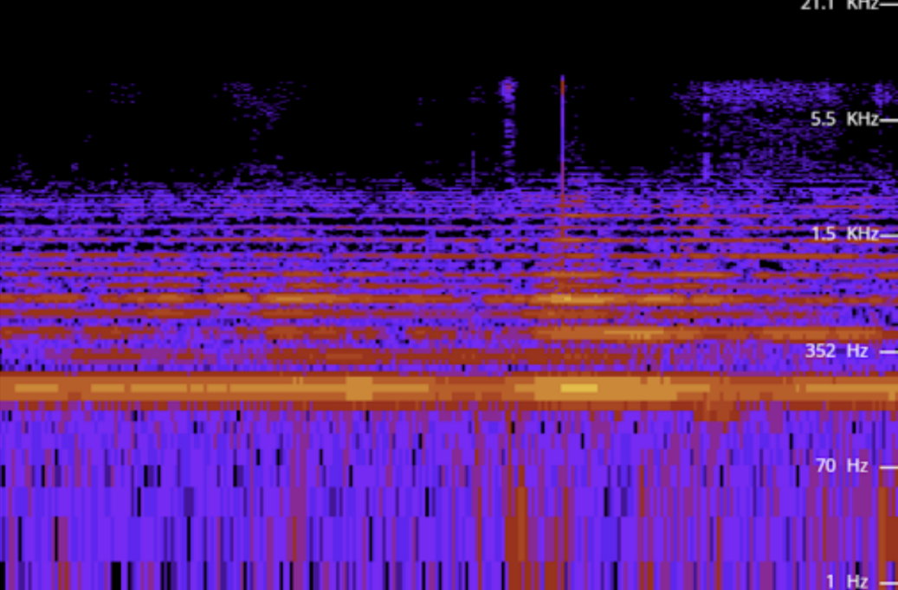
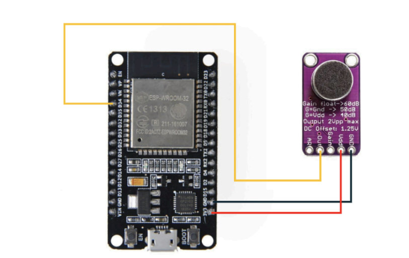

# 🛡️ Acoustic UAV Detection System (IoT)

**Junior Academy of Sciences (MAN) Research Project | 2024-2025**

> **🏆 Achievement:** This project won **3rd Place** at the All-Ukrainian stage of the Junior Academy of Sciences (MAN) research competition defense.

An automated system designed to detect and position low-flying Unmanned Aerial Vehicles (UAVs), specifically "Shahed-136/Geran-2" types, based on their acoustic signature.

## 🎯 Project Goal
To create a low-cost, decentralized network of acoustic sensors capable of detecting enemy drones by their engine noise (approx. 110 Hz / 6600 RPM) and visualizing their location on a real-time map.

## ⚙️ How It Works
1.  **Detection:** A high-sensitivity **MAX9814** microphone captures ambient sound.
2.  **Processing:** An **ESP8266** microcontroller processes the analog signal, calculating the noise level in decibels (dB) using a calibrated logarithmic formula.
3.  **Transmission:** Data is sent via Wi-Fi to **Google Firebase Realtime Database**.
4.  **Visualization:** A web dashboard (using **Leaflet.js** & **OpenStreetMap**) displays the sensor's status and noise levels. If the noise exceeds a threshold (characteristic of a drone engine), the marker turns red.

## 🛠️ Hardware & Tech Stack
* **Microcontroller:** ESP8266 (NodeMCU / Wemos D1 Mini)
* **Sensor:** MAX9814 (Electret Microphone with AGC)
* **Cloud:** Google Firebase Realtime DB
* **Frontend:** HTML5, JavaScript, Leaflet.js
* **Firmware:** C++ (Arduino IDE)

## 📊 Scientific Basis
The project relies on spectral analysis of the UAV's acoustic footprint. The "Shahed" drone engine generates a distinct noise pattern in the 200-2000 Hz range with a fundamental frequency around 110 Hz.

*(Spectrum analysis of a Shahed drone flight)*

## 🔌 Circuit Diagram
The MAX9814 module is connected to the Analog Input (A0) of the ESP8266.

## 🚀 Usage
1.  **Firmware:** Upload the code from `/firmware` to the ESP8266 using Arduino IDE. *Note: Update `config.h` with your Wi-Fi credentials.*
2.  **Web Interface:** Open `/web-interface/index.html` in a browser to monitor the sensor.

## ⚠️ Security Note
This repository contains the source code and research data. Sensitive API keys and specific deployment coordinates have been removed for security reasons.

---
*Developed by Myroslav Kuklyshyn, Uzhhorod Lyceum "LIDER"*
